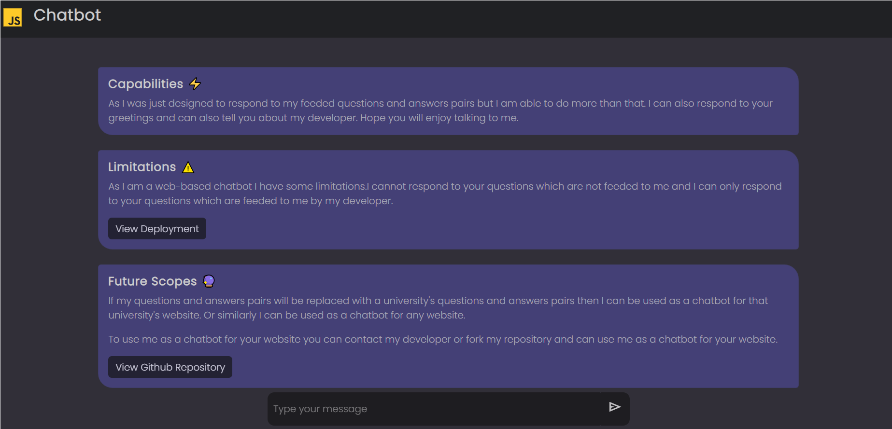

## CHATBOT :D

Meet **Chatbot :D**, It is a simple chatbot  implemented using Javascript , HTML5 and CSS3 designed to respond to user prompts on the basis of its given question and reponse pairs. It is general purpose chatbot which can be used to answer simple questions. It can be used as a website's FAQ chatbot. It can be used to answer the queries of the customers. It can be use for school and college FAQ bot.

| Features  ⚡ | Limitations 🚧 | Future Scope 🔮 |
| :---: | :---: | :---: |
| Can respond to user prompts on the basis of its given question and reponse pairs. | Can only respond to user prompts on the basis of its given question and reponse pairs. | If the question and response pair is replaced with an organization's FAQ, it can be used to answer the queries of the customers. |
| Can be used to answer simple questions. | Can only answer simple questions. | Can be used to answer questions related to a particular topic. |

## How to use Chatbot :D as your website's FAQ chatbot?

- [ ] Fork this repository.
- [ ] Clone the forked repository in your local machine. Use the following command to clone the repository.

```bash
    git clone url_of_the_forked_repository
```
- [ ] Open the cloned repository in your favourite code editor. Then navigate to `model/intents.js` file and replace the question and response pairs with your organization's FAQ.
- [ ] Then feel free to customize the UI of the chatbot by changing the `styles/css/style.css` file.
- [ ] Then deploy the chatbot using [Vercel](https://vercel.com/). You can also deploy the chatbot using [Github Pages](https://pages.github.com/) or [Netlify](https://www.netlify.com/).


## Talk to chatbot at : https://chatbot-d.vercel.app

or click the button below to talk to Chatbot :D 

[](https://chatbot-d.vercel.app/)
